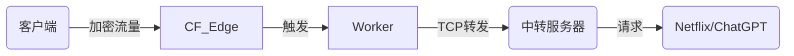
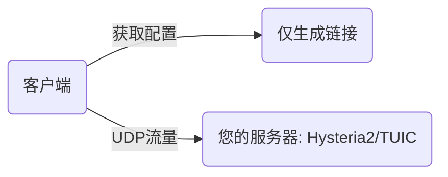
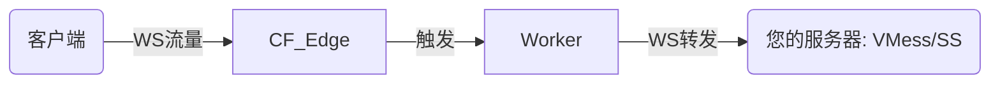

# CFnew - 终端 v2.9.3

**语言:** [中文](README.md) | [فارسی](فارسی.md)

[Telegram 交流群](https://t.me/+ft-zI76oovgwNmRh)

## 📖 目录

1.  [简介与功能](#简介与功能)
2.  [核心概念: 邮差的比喻 (The Mailman Analogy)](#核心概念-邮差的比喻-the-mailman-analogy)
3.  [核心架构与流量流向 (System Architecture)](#核心架构与流量流向-system-architecture)
4.  [配置百科全书 (Configuration Encyclopedia)](#配置百科全书-configuration-encyclopedia)
    *   [1. 身份与认证 (Identity)](#1-身份与认证-identity)
    *   [2. 网络与中继 (Network & Relay)](#2-网络与中继-network--relay)
    *   [3. 协议开关 (Protocols)](#3-协议开关-protocols)
    *   [4. 逻辑控制 (Logic Control)](#4-逻辑控制-logic-control)
    *   [5. 优选与高级 (Preferred & Advanced)](#5-优选与高级-preferred--advanced)
5.  [协议深度解析 (Protocol Deep Dive)](#协议深度解析-protocol-deep-dive)
    *   [Native vs Link-Only](#native-vs-link-only)
    *   [ECH 技术详解](#ech-技术详解)
6.  [使用场景与最佳实践 (Scenarios)](#使用场景与最佳实践-scenarios)
7.  [从零开始安装 (Zero to Hero)](#从零开始安装-zero-to-hero)
8.  [客户端配置指南](#客户端配置指南)
9.  [故障排除 (Troubleshooting)](#故障排除-troubleshooting)
10. [API 管理](#api-管理)
11. [Star History](#star-history)

---

## 简介与功能

CFnew 是一个运行在 Cloudflare Workers 上的全能代理脚本。它利用 Cloudflare 的全球边缘网络，为您提供快速、安全、抗封锁的网络连接。

*   **多协议并发**: 原生支持 VLESS, Trojan, VLESS gRPC, xhttp，并支持生成 VMess, Shadowsocks, TUIC, Hysteria 2 订阅链接。
*   **高度隐蔽**: 支持自定义路径 (Hidden Path) 和伪装首页，完美模拟正常网站。
*   **图形化管理**: 内置 Web 面板，通过 KV 存储配置，无需修改代码即可实时调整。
*   **智能流控**: 集成 ProxyIP 中继、优选 IP 管理、DoH 代理、延迟测试等高级功能。
*   **自动化**: 支持 API 调用，方便编写脚本自动更新优选 IP。

---

## 核心概念: 邮差的比喻 (The Mailman Analogy)

为了让大家彻底理解代理是如何工作的，我们将其拆解为一个详细的**邮政系统**比喻。

### 角色分配
*   **您 (Client)**: 寄信人。
*   **目标网站 (Google/YouTube)**: 收信人。
*   **防火墙 (Firewall)**: 严格的邮局检查员，禁止寄信给“黑名单”上的收信人。
*   **Cloudflare Worker**: 位于自由贸易区的中转站工作人员。
*   **UUID**: 您的专属印章/通行证。
*   **ProxyIP**: 秘密快递员。

### 流程拆解

#### 1. 封装 (The Envelope)
您想给 Google 写信，但不能直接写“To: Google”，否则会被邮局拦截。
*   **动作**: 您把写给 Google 的信（加密数据），装进一个写着 **"To: Cloudflare"** 的普通商业信封里。
*   **认证**: 您在信封口盖上您的 **UUID 印章**。只有拥有核对名册的 Worker 才能确认这是您的信。
*   **协议**: 这就是 **VLESS/Trojan** 协议的作用——伪装和封装。

#### 2. 投递 (Transmission)
*   **动作**: 您把信投进本地邮筒。
*   **检查**: 邮局检查员（防火墙）拿起信封，看到收件人是 "Cloudflare公司"（一家合法的跨国企业），并且信封看起来很正规（HTTPS/TLS 加密），于是放行。
*   **结果**: 您的信成功飞越了封锁线，到达了 Cloudflare 的仓库。

#### 3. 分拣 (Sorting - The Worker)
*   **接收**: Cloudflare 的 Worker 收到信。
*   **验证**: Worker 首先检查 **UUID 印章**。
    *   *印章错误?* -> 直接丢弃或退回（拒绝连接）。
    *   *印章正确?* -> 打开外层信封。
*   **读取**: Worker 拿出里面的信，看到真正的收件人是 **"Google"**。

#### 4. 派送 (Delivery Methods)
这时候，Worker 有两种派送方式（取决于您的配置）：

*   **🅰️ 亲自送达 (Native Mode)**
    *   Worker 直接走出仓库，敲开 Google 的门，把信交给它。
    *   *特点*: 速度快，但 Google 看到的是 Worker 的脸（Cloudflare IP）。

*   **🅱️ 秘密快递 (ProxyIP Mode)**
    *   Worker 觉得直接去不安全（或者 Google 不喜欢 Cloudflare 的人），于是他把信交给了一位**秘密快递员 (ProxyIP)**。
    *   快递员拿着信去送给 Google。
    *   *特点*: Google 看到的是快递员的脸（住宅 IP / 当地 IP），非常适合看 Netflix。

#### 5. 回信 (The Reply)
*   Google 写好回信，交给 Worker（或快递员转交）。
*   Worker 把回信装进一个 **"From: Cloudflare"** 的信封。
*   信封回到您的手中。邮局检查员只看到您收到了一封来自 Cloudflare 的商务信件。

---

## 核心架构与流量流向 (System Architecture)

理解流量如何流动是配置的关键。CFnew 支持四种主要的流量模式。

### 1. 原生模式 (Native Mode)
*适用: VLESS, Trojan, VLESS gRPC, xhttp*
Worker 直接处理流量并访问互联网。速度最快，但 IP 为 Cloudflare 数据中心 IP。


### 2. ProxyIP 模式 (Relay Mode)
*适用: VLESS, Trojan (配合 p 变量)*
Worker 接收请求后，通过 TCP 转发给指定的 ProxyIP，由 ProxyIP 访问目标。用于解锁流媒体或隐藏 Worker IP。



### 3. Link-Only 直连模式 (Direct)
*适用: TUIC, Hysteria 2*
Worker **仅作为订阅生成器**。流量**不经过** Cloudflare，直接连接您的后端服务器。



### 4. Link-Only 转发模式 (Relay)
*适用: VMess, Shadowsocks (配合 evm/ess 变量)*
Worker 建立 WebSocket 连接转发流量到您的后端服务器。



---

## 配置百科全书 (Configuration Encyclopedia)

这里包含代码中所有可用的配置变量。
**优先级**: KV (图形界面) > 环境变量 (Settings)。

### 1. 身份与认证 (Identity)

| 变量名 | 类型 | 默认值 | 说明 | 示例 |
| :--- | :--- | :--- | :--- | :--- |
| **`u`** | String | (必需) | **UUID**。用户的唯一标识符。连接时的密码。 | `84439981-04b6...` |
| **`tp`** | String | `u` | **Trojan Password**。Trojan 协议专用的密码。留空则使用 UUID。 | `mysecurepass` |

### 2. 网络与中继 (Network & Relay)

| 变量名 | 类型 | 默认值 | 说明 | 示例 |
| :--- | :--- | :--- | :--- | :--- |
| **`p`** | String | (空) | **ProxyIP**。流量转发目标 (IP:Port)。用于解锁/隐藏 IP。 | `1.2.3.4` |
| **`s`** | String | (空) | **SOCKS5**。格式 `user:pass@host:port`。优先级高于 `p`。 | `u:p@1.1.1.1:1080` |
| **`d`** | String | (空) | **自定义路径**。设置后，必须通过 `domain.com/路径` 访问面板。 | `/secret` |
| **`wk`** | String | (自动) | **Worker Region**。强制指定 Worker 地区 (如 SG, US)。 | `SG` |

### 3. 协议开关 (Protocols)

设置为 `yes` 开启，`no` 关闭。

| 变量名 | 协议 | 类型 | 说明 | 依赖 |
| :--- | :--- | :--- | :--- | :--- |
| **`ev`** | VLESS | Native | 最轻量，无状态，性能最佳。 | - |
| **`et`** | Trojan | Native | 模拟 HTTPS 流量，抗干扰强。 | - |
| **`ex`** | xhttp | Native | 基于 HTTP POST 的伪装协议。 | 需 gRPC 支持 |
| **`eg`** | VLESS gRPC | Native | 使用 gRPC 传输。 | 需客户端支持 |
| **`evm`** | VMess | Relay | 仅生成链接。需自建后端。 | 后端服务器 |
| **`ess`** | Shadowsocks | Relay | 仅生成链接。需自建后端。 | 后端服务器 |
| **`etu`** | TUIC | Direct | 仅生成链接。UDP 协议。 | 后端服务器 |
| **`ehy`** | Hysteria 2 | Direct | 仅生成链接。UDP 协议。 | 后端服务器 |
| **`ech`** | ECH | - | 启用 Encrypted Client Hello。 | 需 DoH 支持 |

### 4. 逻辑控制 (Logic Control)

| 变量名 | 功能 | 默认 | 说明 |
| :--- | :--- | :--- | :--- |
| **`rm`** | Region Match | `yes` | **地区匹配**。是否根据访问者 IP 自动匹配最近的 Worker 节点。 |
| **`qj`** | Downgrade | `yes` | **降级控制**。设为 `no` 开启自动故障转移 (CF直连 -> ProxyIP)。 |
| **`dkby`** | Port Filter | `no` | **端口过滤**。设为 `yes` 则只生成 TLS (443等) 节点，屏蔽非 TLS (80等)。 |
| **`yxby`** | Prefer Filter | `no` | **优选过滤**。设为 `yes` 则**禁用**所有优选 IP，只保留原生地址。 |
| **`ae`** | API Enable | `no` | **API 开关**。设为 `yes` 允许通过 API 修改配置/IP。 |
| **`scu`** | SubConverter | (内置) | **订阅转换后端**。用于将 VLESS 链接转换为 Clash/Surge 格式。 |
| **`homepage`** | Camouflage | (空) | **伪装首页**。访问根路径 `/` 时显示的内容 URL。 |

### 5. 优选与高级 (Preferred & Advanced)

| 变量名 | 说明 | 默认 |
| :--- | :--- | :--- |
| **`yx`** | **自定义优选 IP 列表**。最高优先级。格式: `IP:Port#备注`。 | - |
| **`yxURL`** | **优选 IP 远程源**。覆盖内置源。指向一个 TXT 文件。 | (内置源) |
| **`epd`** | 是否启用内置的**优选域名**列表。 | `no` |
| **`epi`** | 是否启用**动态优选 IP** (wetest)。 | `true` |
| **`egi`** | 是否启用 **GitHub** 优选源。 | `true` |
| **`ipv4`** | 是否获取 IPv4 优选 IP。 | `yes` |
| **`ipv6`** | 是否获取 IPv6 优选 IP。 | `yes` |
| **`ispMobile`** | 是否包含**中国移动**优选 IP。 | `yes` |
| **`ispTelecom`**| 是否包含**中国电信**优选 IP。 | `yes` |
| **`ispUnicom`** | 是否包含**中国联通**优选 IP。 | `yes` |
| **`customDNS`** | ECH 查询用的 DoH 地址。 | `https://dns.joeyblog.eu.org/joeyblog` |
| **`customECHDomain`** | ECH 目标配置域名。 | `cloudflare-ech.com` |

---

## 协议深度解析 (Protocol Deep Dive)

### Native vs Link-Only

*   **Native (原生处理)**: Worker 拥有完整的协议栈，可以直接解密和处理流量。
    *   *优势*: 无需额外服务器，免费，速度快。
    *   *劣势*: 受限于 Cloudflare Worker 环境 (无 UDP 监听，端口受限)。
*   **Link-Only (仅链接)**: Worker 仅作为配置分发中心。实际的流量处理由您自己的 VPS 完成。
    *   *为什么需要?*: Cloudflare Workers **不支持** UDP 监听，因此无法运行 Hysteria 2 或 TUIC 服务端。
    *   *流量走向*: 客户端 -> 您的 VPS (Worker 此时只是一张写着地址的纸条)。

### ECH 技术详解

**Encrypted Client Hello (ECH)** 是一项旨在加密 TLS 握手阶段 (Client Hello) 的技术，特别是加密 **SNI (Server Name Indication)**。

1.  **问题**: 传统 TLS 握手中，SNI 是明文的。防火墙可以看到您访问了 `google.com` 并阻断连接。
2.  **解决**: ECH 将 SNI 加密。防火墙只能看到您连接到了 Cloudflare，但不知道具体是哪个网站。
3.  **Worker 实现**:
    *   Worker 使用 `customDNS` (必须是 DoH HTTPS 地址) 查询 `customECHDomain` 的 ECH 配置。
    *   Worker 将此配置注入到生成的 VLESS/Trojan 链接中。
    *   客户端使用此配置加密握手信息。

---

## 使用场景与最佳实践 (Scenarios)

### 场景 1: 流媒体解锁 (Netflix/Disney+)
目标: 观看仅限特定地区的内容。
1.  找到一个支持解锁的 ProxyIP (例如新加坡的 IP)。
2.  在 KV 中设置 `p = 1.2.3.4:443` (ProxyIP 地址)。
3.  设置 `wk = SG` (强制匹配新加坡地区，减少延迟)。
4.  客户端连接 -> Worker -> ProxyIP (新加坡) -> Netflix。

### 场景 2: 极致隐蔽与安全 (Paranoid Mode)
目标: 防止探测，防止 SNI 阻断。
1.  设置 `d = /my-super-secret-path`。这样只有知道路径的人才能看到面板。
2.  设置 `ech = yes`。加密 SNI，防火墙无法通过 SNI 识别目标。
3.  设置 `tp = 强密码`。即使 UUID 泄露，Trojan 协议也有第二层保护。
4.  设置 `homepage = https://www.microsoft.com`。直接访问根域名显示微软首页。

### 场景 3: 混合部署 (Hybrid)
目标: 兼顾速度与 UDP 游戏性能。
1.  开启 `ev = yes` (VLESS) 用于日常网页浏览 (Cloudflare CDN 加速)。
2.  开启 `ehy = yes` (Hysteria 2) 并指向您的 VPS。
3.  在客户端同时添加这两个节点。
    *   看视频/下载用 VLESS (省流量，CDN 加速)。
    *   打游戏/语音通话用 Hysteria 2 (UDP 低延迟)。

---

## 从零开始安装 (Zero to Hero)

### 1. 部署 Worker
1.  登录 Cloudflare Dash -> **Workers & Pages** -> **Create Worker**.
2.  命名 (如 `cf-proxy`) -> **Deploy**.
3.  **Edit Code** -> 粘贴 `snippets` 或 `_worker.js` 内容 -> **Save and deploy**.

### 2. 配置 KV (必须!)
1.  **Workers & Pages** -> **KV** -> **Create Namespace** -> 命名为 `CONFIG` -> **Add**.
2.  回到 Worker -> **Settings** -> **Variables** -> **KV Namespace Bindings**.
3.  Add binding -> Variable name: `C` (大写) -> Namespace: `CONFIG` -> **Save**.

### 3. 初始化
1.  **Settings** -> **Variables** -> **Environment Variables**.
2.  添加变量 `u` = `您的UUID`.
3.  访问 `https://您的域名/您的UUID` 进入面板。

---

## 客户端配置指南

为了获得最佳体验，请注意以下客户端设置：

### v2rayNG (Android)
*   **Mux (多路复用)**: 建议**关闭**。虽然理论上能降低握手延迟，但在某些网络环境下会导致断流。
*   **跳过证书验证**: 如果没有自定义域名，建议设为 `true` (允许不安全)。
*   **Sniffing (流量嗅探)**: 建议**开启**，以便正确分流国内外流量。

### Shadowrocket (iOS)
*   **Allow Insecure**: 在设置中开启。
*   **订阅更新**: 建议开启 "打开时更新"，确保获得最新的优选 IP。

### Clash Meta / Mihomo (PC/Android)
*   **内核**: 请务必使用 Meta (Mihomo) 内核。官方 Premium 内核可能不支持 VLESS Reality 或某些 ECH 特性。
*   **Client Fingerprint**: 建议设置为 `chrome`，模拟真实浏览器指纹。

---

## 故障排除 (Troubleshooting)

| 错误代码 | 常见原因 | 解决方案 |
| :--- | :--- | :--- |
| **1101** | Worker 脚本异常 | 1. 检查 KV 是否绑定为变量 `C`。<br>2. 检查代码是否完整复制。 |
| **1033** | Argo Tunnel 错误 | 通常与 Worker 无关，是 Cloudflare 内部网络波动，稍后重试。 |
| **502** | Bad Gateway | **ProxyIP 失效**。Worker 无法连接到您设置的 `p` 地址。请更换或清空 `p`。 |
| **522** | Connection Timed Out | **连接超时**。Worker 无法连接到源站。可能是 IP 被墙或端口未开放。 |
| **节点超时** | 网络不通 | 1. 检查 `u` (UUID) 是否匹配。<br>2. 检查客户端是否开启 TLS。<br>3. 尝试使用优选 IP。 |

---

## API 管理

**Base URL**: `https://您的域名/您的路径/api/preferred-ips`

### 1. 获取所有 IP
```bash
curl -X GET https://domain.com/uuid/api/preferred-ips
```

### 2. 添加 IP
```bash
curl -X POST https://domain.com/uuid/api/preferred-ips \
  -H "Content-Type: application/json" \
  -d '{"ip": "1.2.3.4", "port": 443, "name": "SG-Optimized"}'
```

### 3. 删除 IP
```bash
curl -X DELETE https://domain.com/uuid/api/preferred-ips \
  -H "Content-Type: application/json" \
  -d '{"ip": "1.2.3.4"}'
```

### 4. 清空所有
```bash
curl -X DELETE https://domain.com/uuid/api/preferred-ips \
  -H "Content-Type: application/json" \
  -d '{"all": true}'
```

---

## Star History

[](https://www.star-history.com/#byJoey/cfnew&Timeline&LogScale)
