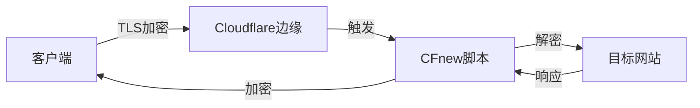
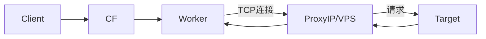

# CFnew - 终端 v2.9.3

**语言:** [中文](README.md) | [فارسی](فارسی.md)

[Telegram 交流群](https://t.me/+ft-zI76oovgwNmRh)

## 📖 目录

1.  [简介与设计哲学 (Introduction & Philosophy)](#简介与设计哲学-introduction--philosophy)
2.  [核心概念: 邮差的比喻 (The Mailman Analogy)](#核心概念-邮差的比喻-the-mailman-analogy)
3.  [核心架构与流量流向 (System Architecture)](#核心架构与流量流向-system-architecture)
4.  [配置百科全书 (Configuration Encyclopedia)](#配置百科全书-configuration-encyclopedia)
    *   [1. 身份与认证 (Identity)](#1-身份与认证-identity)
    *   [2. 网络与中继 (Network & Relay)](#2-网络与中继-network--relay)
    *   [3. 协议开关 (Protocols)](#3-协议开关-protocols)
    *   [4. 逻辑控制 (Logic Control)](#4-逻辑控制-logic-control)
    *   [5. 优选与高级 (Preferred & Advanced)](#5-优选与高级-preferred--advanced)
5.  [协议深度解析与对比 (Protocol Deep Dive)](#协议深度解析与对比-protocol-deep-dive)
6.  [使用场景与最佳实践 (Scenarios)](#使用场景与最佳实践-scenarios)
7.  [从零开始安装 (Zero to Hero)](#从零开始安装-zero-to-hero)
8.  [客户端配置指南 (Client Configuration)](#客户端配置指南-client-configuration)
9.  [故障排除与日志 (Troubleshooting & Logs)](#故障排除与日志-troubleshooting--logs)
10. [API 管理指南 (API Management)](#api-管理指南-api-management)
11. [Star History](#star-history)

---

## 简介与设计哲学 (Introduction & Philosophy)

CFnew 是一个运行在 Cloudflare Workers 上的全能代理脚本，专为**抗封锁**、**高性能**和**易管理**而设计。

*   **无服务器 (Serverless)**: 无需购买 VPS，利用 Cloudflare 遍布全球的 300+ 数据中心。
*   **无代码管理 (No-Code Management)**: 一旦部署，所有配置（UUID、IP、协议开关）均通过 KV 存储在网页端图形化管理。您永远不需要再次编辑代码文件。
*   **多态伪装 (Polymorphic Camouflage)**: 既是 VLESS 节点，也是 Trojan 节点，还能通过自定义路径伪装成普通的微软或谷歌页面。
*   **智能路由 (Intelligent Routing)**: 内置地理位置匹配，自动让 Worker 连接到离您物理位置最近的数据中心。

---

## 核心概念: 邮差的比喻 (The Mailman Analogy)

为了让大家彻底理解代理是如何工作的，我们将其拆解为一个详细的**邮政系统**比喻。

### 角色分配
*   **您 (Client)**: 寄信人（试图访问被墙网站的用户）。
*   **目标网站 (Google/YouTube)**: 收信人。
*   **防火墙 (Firewall)**: 严格的邮局检查员，持有“黑名单”，禁止直接寄信给 Google。
*   **Cloudflare Worker**: 位于“自由贸易区”的中转站工作人员（合法的中转站）。
*   **UUID**: 您的专属印章/通行证（防止外人滥用您的中转服务）。
*   **ProxyIP**: 住在目标网站隔壁的“好邻居”（秘密快递员）。

### 流程拆解

#### 1. 封装 (The Envelope)
您想给 Google 写信，但不能直接写“To: Google”。
*   **动作**: 您把写给 Google 的信（加密数据），装进一个写着 **"To: Cloudflare"** 的普通商业信封里。
*   **认证**: 您在信封口盖上您的 **UUID 印章**。只有拥有核对名册的 Worker 才能确认这是您的信。
*   **协议**: 这就是 **VLESS/Trojan** 协议的作用——伪装和封装。

#### 2. 投递 (Transmission)
*   **动作**: 您把信投进本地邮筒。
*   **检查**: 邮局检查员（防火墙）拿起信封，看到收件人是 "Cloudflare公司"（一家合法的跨国企业），并且信封看起来很正规（HTTPS/TLS 加密），于是放行。
*   **结果**: 您的信成功飞越了封锁线，到达了 Cloudflare 的全球仓库。

#### 3. 分拣 (Sorting - The Worker)
*   **接收**: Cloudflare 的 Worker 收到信。
*   **验证**: Worker 首先检查 **UUID 印章**。
    *   *印章错误?* -> 直接丢弃或退回（拒绝连接）。
    *   *印章正确?* -> 打开外层信封。
*   **读取**: Worker 拿出里面的信，看到真正的收件人是 **"Google"**。

#### 4. 派送 (Delivery Methods)
这时候，Worker 有两种派送方式（取决于您的配置）：

*   **🅰️ 亲自送达 (Native Mode)**
    *   Worker 直接走出仓库，敲开 Google 的门，把信交给它。
    *   *特点*: 速度快，但 Google 看到的是 Worker 的脸（Cloudflare IP）。某些网站（如 Netflix）可能会因为“不喜欢 Cloudflare 员工”而拒绝服务。

*   **🅱️ 秘密快递 (ProxyIP Mode)**
    *   Worker 觉得直接去不安全，或者 Google 拒收 Cloudflare 的信。
    *   Worker 把信交给了一位**秘密快递员 (ProxyIP)**。
    *   快递员拿着信去送给 Google。
    *   *特点*: Google 看到的是快递员的脸（住宅 IP / 当地 IP），非常适合解锁流媒体。

#### 5. 回信 (The Return Journey)
*   Google 写好回信，交给快递员或 Worker。
*   Worker 把回信装进一个 **"From: Cloudflare"** 的信封。
*   信封回到您的手中。邮局检查员只看到您收到了一封来自 Cloudflare 的商务信件，完全不知道里面是 Google 的回复。

---

## 核心架构与流量流向 (System Architecture)

### 1. 原生模式 (Native Mode)
*适用: VLESS, Trojan, VLESS gRPC, xhttp*
Worker 直接处理流量。延迟最低。



### 2. ProxyIP 模式 (Relay Mode)
*适用: VLESS, Trojan (配合 p 变量)*
Worker 通过 TCP 将流量中继给第三方 IP。



### 3. ECH 握手流程 (ECH Flow)
*适用: 开启 ECH 功能后*
SNI 被加密，防火墙无法看到目标域名。

```mermaid
graph TD
    Client -->|1. 获取ECH配置| DoH[DoH服务器]
    DoH -->|2. 返回公钥| Client
    Client -->|3. ClientHello (加密SNI)| CF
    CF -->|4. 解密SNI| Worker
    Worker --> Target
```

---

## 配置百科全书 (Configuration Encyclopedia)

这里包含代码中所有可用的配置变量。
**优先级**: KV (图形界面) > 环境变量 (Settings)。

### 1. 身份与认证 (Identity)

| 变量名 | 类型 | 默认值 | 详细说明 | 为什么使用? |
| :--- | :--- | :--- | :--- | :--- |
| **`u`** | String | (必需) | **UUID**。用户的唯一标识符。连接时的密码。必须是标准的 UUID 格式。 | **安全**。防止未授权用户使用您的代理消耗流量。 |
| **`tp`** | String | `u` | **Trojan Password**。Trojan 协议专用的密码。留空则自动使用 UUID。客户端会对密码进行 SHA224 哈希。 | **兼容性**。某些旧版 Trojan 客户端可能不支持 UUID 格式的密码。 |

### 2. 网络与中继 (Network & Relay)

| 变量名 | 类型 | 默认值 | 详细说明 | 为什么使用? |
| :--- | :--- | :--- | :--- | :--- |
| **`p`** | String | (空) | **ProxyIP**。流量转发目标 (IP:Port)。Worker 收到请求后，不直接访问目标，而是转发给这个 IP。 | **解封/隐藏**。解决 CF IP 被墙、被网站屏蔽 (如 Netflix) 问题。 |
| **`s`** | String | (空) | **SOCKS5**。格式 `user:pass@host:port`。优先级高于 `p`。支持基于用户名密码的认证。 | **特定出口**。如果您有特定国家的 SOCKS5 代理，想让流量从那里出来。 |
| **`d`** | String | (空) | **自定义路径**。设置后，必须通过 `domain.com/路径` 访问面板。UUID 路径将失效。 | **防探测**。让 Worker 看起来像个普通网站，只有知道路径的人才能看到面板。 |
| **`wk`** | String | (自动) | **Worker Region**。强制指定 Worker 地区 (如 `SG`, `US`, `JP`)。 | **就近接入**。强制 Worker 使用指定地区的优选 IP，降低延迟。 |

### 3. 协议开关 (Protocols)

设置为 `yes` 开启，`no` 关闭。

| 变量名 | 协议 | 类型 | 说明 | 适用场景 |
| :--- | :--- | :--- | :--- | :--- |
| **`ev`** | VLESS | Native | 最轻量，无状态，性能最佳。 | 日常浏览，看视频 (4K)。 |
| **`et`** | Trojan | Native | 模拟 HTTPS 流量，抗干扰强。 | 网络审查严格的环境。 |
| **`ex`** | xhttp | Native | 基于 HTTP POST 的伪装协议。 | 需要极致伪装，通过 gRPC 传输。 |
| **`eg`** | VLESS gRPC | Native | 使用 gRPC 传输。 | 对长连接支持较好的网络。 |
| **`evm`** | VMess | Relay | 仅生成链接。需自建后端。 | 手里有闲置 VPS，想通过 CF 中转。 |
| **`ess`** | Shadowsocks | Relay | 仅生成链接。需自建后端。 | 老旧设备，或者是 SS 专用的后端。 |
| **`etu`** | TUIC | Direct | 仅生成链接。UDP 协议。 | 游戏加速，低延迟需求 (需后端)。 |
| **`ehy`** | Hysteria 2 | Direct | 仅生成链接。UDP 协议。 | 恶劣网络环境下的暴力加速 (需后端)。 |
| **`ech`** | ECH | - | 启用 Encrypted Client Hello。 | 防止 SNI 阻断，最高安全级别。 |

### 4. 逻辑控制 (Logic Control)

| 变量名 | 功能 | 默认 | 详细说明 |
| :--- | :--- | :--- | :--- |
| **`rm`** | Region Match | `yes` | **地区匹配**。是否根据访问者 IP 自动匹配最近的 Worker 节点。设为 `no` 则随机分配。 |
| **`qj`** | Downgrade | `yes` | **降级控制**。设为 `no` 开启自动故障转移。逻辑：CF直连失败 -> 尝试 SOCKS5 -> 尝试 ProxyIP。 |
| **`dkby`** | Port Filter | `no` | **端口过滤**。设为 `yes` 则只生成 TLS (443/2053等) 节点，屏蔽非 TLS (80/8080等)。ECH 开启时强制为 yes。 |
| **`yxby`** | Prefer Filter | `no` | **优选过滤**。设为 `yes` 则**禁用**所有优选 IP，只保留原生 Worker 地址。 |
| **`ae`** | API Enable | `no` | **API 开关**。设为 `yes` 允许通过 REST API 修改配置/IP。建议仅在需要时开启。 |
| **`scu`** | SubConverter | (内置) | **订阅转换后端**。用于将 VLESS 链接转换为 Clash/Surge 格式。默认使用 `url.v1.mk`。 |
| **`homepage`**| Camouflage | (空) | **伪装首页**。访问根路径 `/` 时，Worker 会获取此 URL 的内容并返回。模拟真实网站。 |

### 5. 优选与高级 (Preferred & Advanced)

这些变量控制如何获取和过滤优选 IP。

| 变量名 | 说明 | 默认 | 过滤逻辑 |
| :--- | :--- | :--- | :--- |
| **`yx`** | **自定义优选 IP 列表**。KV 中直接存储。格式: `IP:Port#备注`。 | - | 最高优先级，不做运营商过滤。 |
| **`yxURL`** | **优选 IP 远程源**。覆盖内置源。指向一个 TXT 文件。 | (内置) | 从 URL 下载 IP 列表。 |
| **`ipv4`** | 是否获取 IPv4 优选 IP。 | `yes` | 设为 `no` 则丢弃源中的 IPv4 地址。 |
| **`ipv6`** | 是否获取 IPv6 优选 IP。 | `yes` | 设为 `no` 则丢弃源中的 IPv6 地址。 |
| **`ispMobile`**| 是否包含**中国移动**优选 IP。 | `yes` | 根据备注关键词过滤。 |
| **`ispTelecom`**| 是否包含**中国电信**优选 IP。 | `yes` | 根据备注关键词过滤。 |
| **`ispUnicom`** | 是否包含**中国联通**优选 IP。 | `yes` | 根据备注关键词过滤。 |
| **`customDNS`** | ECH 查询用的 DoH 地址 (HTTPS)。 | (内置) | 用于解析 ECH 配置。不支持 UDP 53。 |
| **`customECHDomain`**| ECH 目标配置域名。 | (内置) | 从该域名获取 ECHConfig。 |

---

## 协议深度解析与对比 (Protocol Deep Dive)

| 特性 | VLESS (Native) | Trojan (Native) | VMess (Relay) | TUIC/Hysteria (Direct) |
| :--- | :--- | :--- | :--- | :--- |
| **类型** | 无状态轻量协议 | 模拟 HTTPS | 经典协议 | UDP 高速协议 |
| **Worker 角色** | 代理服务器 | 代理服务器 | WebSocket 中继 | 配置生成器 (不经手流量) |
| **后端需求** | 无 (Serverless) | 无 (Serverless) | 需要 VPS | 需要 VPS |
| **抗封锁** | ⭐⭐⭐⭐ | ⭐⭐⭐⭐⭐ | ⭐⭐⭐ | ⭐⭐⭐⭐⭐ (拥塞控制) |
| **延迟** | 🟢 极低 | 🟢 低 | 🟡 中 (多一跳) | 🟢 极低 (UDP) |
| **资源消耗** | 🟢 极低 | 🟡 低 | 🔴 高 | 🟡 中 |
| **适用场景** | 4K 视频, 浏览 | 敏感时期, 办公 | 旧设备兼容 | 游戏, 恶劣网络环境 |

### ECH 技术详解
**Encrypted Client Hello (ECH)** 是一项旨在加密 TLS 握手阶段 (Client Hello) 的技术，特别是加密 **SNI (Server Name Indication)**。
1.  **问题**: 传统 TLS 握手中，SNI 是明文的。防火墙可以看到您访问了 `google.com` 并阻断连接。
2.  **解决**: ECH 将 SNI 加密。防火墙只能看到您连接到了 Cloudflare，但不知道具体是哪个网站。
3.  **Worker 实现**: Worker 充当 ECH 配置的“分发者”，通过 DoH (`customDNS`) 获取配置并注入订阅。

---

## 使用场景与最佳实践 (Scenarios)

### 场景 1: ISP 专属优化 (ISP Optimization)
**目标**: 您是中国移动宽带用户，想要最快的连接。
1.  进入配置面板。
2.  设置 `ispMobile = yes`。
3.  设置 `ispTelecom = no` 和 `ispUnicom = no`。
4.  设置 `epi = yes` (启用动态优选)。
5.  **结果**: 订阅链接中将只包含对中国移动线路优化过的 Cloudflare IP，减少丢包。

### 场景 2: 游戏低延迟模式 (Gaming Mode)
**目标**: 玩外服游戏，需要 UDP 和低延迟。
1.  您需要一台自建的 Hysteria 2 服务器 (VPS)。
2.  在 Worker 中设置 `ehy = yes`。
3.  Worker 会生成指向您 VPS 的 Hysteria 2 链接。
4.  客户端使用该链接连接。由于 Hysteria 2 基于 UDP，游戏延迟将显著低于 TCP 协议。

### 场景 3: 极致隐蔽与安全 (Paranoid Mode)
**目标**: 防止探测，防止 SNI 阻断。
1.  设置 `d = /my-super-secret-path`。
2.  设置 `ech = yes`。加密 SNI。
3.  设置 `homepage = https://www.microsoft.com`。直接访问根域名显示微软首页。
4.  **结果**: 即使防火墙主动探测您的域名，看到的也只是微软首页；流量分析也无法得知目标网站。

---

## 从零开始安装 (Zero to Hero)

### 1. 部署 Worker
1.  登录 [Cloudflare Dash](https://dash.cloudflare.com)。
2.  选择 **Workers & Pages** -> **Create Worker**。
3.  命名 (如 `cf-proxy`) -> **Deploy**。
4.  点击 **Edit Code**。
5.  **关键步骤**: 打开本项目的 `少年你相信光吗` 文件，全选复制。
6.  清空 Cloudflare 编辑器中的代码，粘贴进去。
7.  **Save and deploy**。

### 2. 配置 KV (必须!)
没有 KV，图形面板无法保存配置。
1.  **Workers & Pages** -> **KV** -> **Create Namespace** -> 命名为 `CONFIG` -> **Add**。
2.  回到您的 Worker -> **Settings** -> **Variables** -> **KV Namespace Bindings**。
3.  **Add binding**:
    *   Variable name: `C` (必须是大写)。
    *   Namespace: 选择 `CONFIG`。
4.  **Save and deploy**。

### 3. 初始化变量
1.  **Settings** -> **Variables** -> **Environment Variables**。
2.  **Add variable**:
    *   Variable name: `u`
    *   Value: `您的UUID` (使用 `uuidgen` 生成)。
3.  **Save and deploy**。

### 4. 验证
访问 `https://您的域名/您的UUID`。如果看到带有矩阵雨特效的终端界面，说明部署成功！

---

## 客户端配置指南 (Client Configuration)

### Sing-box
*   **配置**: 建议使用 `vless` 或 `trojan` outbound。
*   **ECH**: 在 `tls` 配置段中添加 `ech: { enabled: true }`。
*   **Multiplex**: 建议开启 `multiplex: { enabled: true }` 以提高并发性能。

### v2rayNG (Android)
*   **Sniffing**: 必须开启 (流量嗅探)，否则无法正确分流国内外流量。
*   **Mux**: 建议关闭。虽然理论上降低延迟，但在不稳定网络下容易导致断流。

### Surge (iOS/Mac)
*   **Skip-cert-verify**: 如果使用优选 IP，必须设为 `true`。
*   **SNI**: 确保 SNI 字段填写了 Worker 的域名。

---

## 故障排除与日志 (Troubleshooting & Logs)

### 如何查看 Worker 日志?
如果连接失败，查看日志是最好的办法：
1.  Cloudflare Dash -> Worker -> **Logs**。
2.  点击 **Begin log stream**。
3.  尝试用客户端连接一次。
4.  查看日志输出。
    *   `Status 200`: 连接成功。
    *   `Status 403`: UUID 错误或路径错误。
    *   `Status 502`: ProxyIP 无法连接。

### 常见错误代码

| 代码 | 错误信息 | 原因 | 解决方案 |
| :--- | :--- | :--- | :--- |
| **1101** | Worker Threw Exception | 代码错误或 KV 未绑定 | 检查 KV 是否绑定为变量 `C`。检查代码完整性。 |
| **1033** | Argo Tunnel Error | Cloudflare 内部错误 | 通常是临时网络波动，稍后重试。 |
| **1000** | DNS points to prohibited IP | DNS 解析错误 | ProxyIP 可能指向了 Cloudflare 自己的 IP (回环)。更换 ProxyIP。 |
| **1020** | Access Denied | 防火墙规则拦截 | 检查 Cloudflare WAF 规则，是否拦截了特定地区/IP。 |
| **502** | Bad Gateway | 上游无法连接 | **ProxyIP 失效**。Worker 无法连接到 `p` 地址。更换 `p`。 |
| **522** | Connection Timed Out | 连接源站超时 | 目标网站或 ProxyIP 被墙。尝试更换端口或 IP。 |

---

## API 管理指南 (API Management)

**Endpoint**: `https://您的域名/您的路径/api/preferred-ips`
**鉴权**: 目前依赖路径中的 UUID 作为隐式鉴权。

### 1. 获取所有 IP (GET)
```bash
curl -X GET https://domain.com/uuid/api/preferred-ips
```

### 2. 添加 IP (POST)
向优选列表中添加新的 IP。支持自动去重。
```bash
curl -X POST https://domain.com/uuid/api/preferred-ips \
  -H "Content-Type: application/json" \
  -d '{"ip": "1.2.3.4", "port": 443, "name": "SG-Optimized"}'
```

### 3. 删除 IP (DELETE)
删除指定的 IP。
```bash
curl -X DELETE https://domain.com/uuid/api/preferred-ips \
  -H "Content-Type: application/json" \
  -d '{"ip": "1.2.3.4"}'
```

### 4. 清空所有 (DELETE)
一键清空所有优选 IP，恢复默认状态。
```bash
curl -X DELETE https://domain.com/uuid/api/preferred-ips \
  -H "Content-Type: application/json" \
  -d '{"all": true}'
```

---

## Star History

[](https://www.star-history.com/#byJoey/cfnew&Timeline&LogScale)
