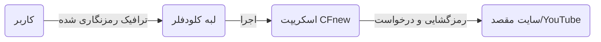
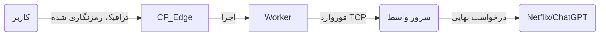
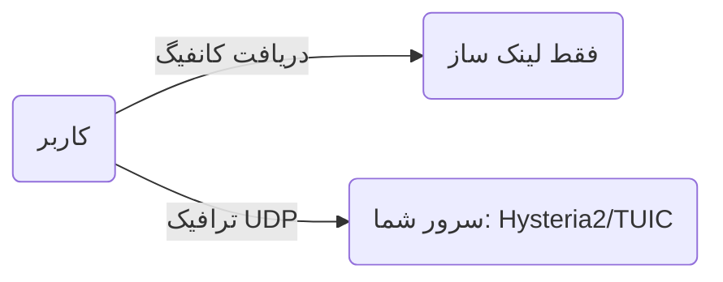
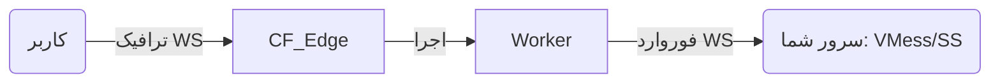

# CFnew - ترمینال v2.9.3

**زبان:** [中文](README.md) | [فارسی](فارسی.md)

[گروه تلگرام](https://t.me/+ft-zI76oovgwNmRh)

## 📖 فهرست مطالب

1.  [معرفی و امکانات](#معرفی-و-امکانات)
2.  [مفاهیم کلیدی: مثال پستچی (The Mailman Analogy)](#مفاهیم-کلیدی-مثال-پستچی-the-mailman-analogy)
3.  [معماری سیستم و جریان ترافیک (System Architecture)](#معماری-سیستم-و-جریان-ترافیک-system-architecture)
4.  [دانشنامه پیکربندی (Configuration Encyclopedia)](#دانشنامه-پیکربندی-configuration-encyclopedia)
    *   [۱. هویت و احراز هویت (Identity)](#۱-هویت-و-احراز-هویت-identity)
    *   [۲. شبکه و رله (Network & Relay)](#۲-شبکه-و-رله-network--relay)
    *   [۳. تنظیم پروتکل‌ها (Protocols)](#۳-تنظیم-پروتکل‌ها-protocols)
    *   [۴. کنترل منطقی (Logic Control)](#۴-کنترل-منطقی-logic-control)
    *   [۵. ترجیحات و پیشرفته (Preferred & Advanced)](#۵-ترجیحات-و-پیشرفته-preferred--advanced)
5.  [بررسی عمیق پروتکل‌ها (Protocol Deep Dive)](#بررسی-عمیق-پروتکل‌ها-protocol-deep-dive)
    *   [Native در برابر Link-Only](#native-در-برابر-link-only)
    *   [تکنولوژی ECH چیست؟](#تکنولوژی-ech-چیست)
6.  [سناریوهای استفاده و بهترین روش‌ها](#سناریوهای-استفاده-و-بهترین-روش‌ها-scenarios)
7.  [راهنمای نصب از صفر (Zero to Hero)](#راهنمای-نصب-از-صفر-zero-to-hero)
8.  [راهنمای تنظیمات کلاینت](#راهنمای-تنظیمات-کلاینت)
9.  [عیب‌یابی (Troubleshooting)](#عیب‌یابی-troubleshooting)
10. [مدیریت API](#مدیریت-api)
11. [تاریخچه ستاره](#تاریخچه-ستاره)

---

## معرفی و امکانات

CFnew یک اسکریپت پروکسی همه فن حریف است که بر روی Cloudflare Workers اجرا می‌شود. این ابزار از شبکه جهانی لبه (Edge) کلودفلر استفاده می‌کند تا اتصالی سریع، امن و مقاوم در برابر فیلترینگ برای شما فراهم کند.

*   **پشتیبانی همزمان پروتکل‌ها**: پردازش بومی (Native) پروتکل‌های VLESS, Trojan, VLESS gRPC, xhttp و تولید لینک اشتراک برای VMess, Shadowsocks, TUIC, Hysteria 2.
*   **پنهان‌سازی بالا**: پشتیبانی از مسیر مخفی (Hidden Path) و صفحه خوش‌آمدگویی جعلی (Camouflage) برای شبیه‌سازی کامل یک وب‌سایت عادی.
*   **مدیریت گرافیکی**: دارای پنل وب داخلی که تنظیمات را در KV ذخیره می‌کند؛ تغییر آنی تنظیمات بدون نیاز به کدنویسی.
*   **مدیریت هوشمند ترافیک**: یکپارچه‌سازی شده با قابلیت‌های ProxyIP (رله)، مدیریت IPهای تمیز، پروکسی DoH و تست تاخیر.
*   **خودکارسازی**: پشتیبانی از API برای نوشتن اسکریپت و آپدیت خودکار IPهای تمیز.

---

## مفاهیم کلیدی: مثال پستچی (The Mailman Analogy)

برای درک کامل نحوه کار پروکسی و عبور از فیلترینگ، بیایید آن را به یک **سیستم پستی** تشبیه کنیم.

### نقش‌ها
*   **شما (Client)**: فرستنده نامه.
*   **سایت مقصد (Google/YouTube)**: گیرنده نامه.
*   **فیلترچی (Firewall)**: بازرس سخت‌گیر اداره پست که اجازه ارسال نامه به "لیست سیاه" را نمی‌دهد.
*   **Cloudflare Worker**: کارمند یک شرکت پستی معتبر و بین‌المللی در منطقه آزاد.
*   **UUID**: مُهر مخصوص یا گذرنامه شما.
*   **ProxyIP**: پیک موتوری مخفی.

### مراحل انجام کار

#### ۱. بسته‌بندی (The Envelope)
شما می‌خواهید به گوگل نامه بنویسید، اما اگر روی پاکت بنویسید "گیرنده: گوگل"، فیلترچی آن را پاره می‌کند.
*   **اقدام**: شما نامه اصلی (داده‌های رمزگذاری شده) را داخل یک پاکت اداری معمولی می‌گذارید که روی آن نوشته شده **"گیرنده: شرکت Cloudflare"**.
*   **احراز هویت**: روی در پاکت، **مُهر UUID** خود را می‌زنید. فقط Worker که لیست مُهرها را دارد می‌فهمد این نامه معتبر است.
*   **پروتکل**: این دقیقاً کاری است که پروتکل‌های **VLESS/Trojan** انجام می‌دهند؛ مخفی‌سازی و بسته‌بندی.

#### ۲. تحویل به پست (Transmission)
*   **اقدام**: نامه را به صندوق پست می‌اندازید.
*   **بازرسی**: فیلترچی نامه را می‌بیند. چون گیرنده "Cloudflare" (یک شرکت معتبر اینترنتی) است و ظاهر نامه کاملاً رسمی و امن (HTTPS/TLS) است، به آن شک نمی‌کند و اجازه عبور می‌دهد.
*   **نتیجه**: نامه شما از سد فیلترینگ عبور می‌کند و به انبار Cloudflare می‌رسد.

#### ۳. تفکیک (Sorting - The Worker)
*   **دریافت**: Worker نامه را تحویل می‌گیرد.
*   **بررسی**: ابتدا **مُهر UUID** را چک می‌کند.
    *   *مُهر اشتباه است؟* -> نامه دور ریخته می‌شود (قطع اتصال).
    *   *مُهر درست است؟* -> پاکت بیرونی را باز می‌کند.
*   **خواندن**: Worker نامه اصلی را می‌بیند و متوجه می‌شود گیرنده واقعی **"Google"** است.

#### ۴. توزیع (Delivery Methods)
حالا Worker دو روش برای رساندن نامه دارد (بسته به تنظیمات شما):

*   **🅰️ تحویل مستقیم (Native Mode)**
    *   Worker شخصاً از انبار خارج می‌شود، به دفتر گوگل می‌رود و نامه را تحویل می‌دهد.
    *   *ویژگی*: سرعت بالا، اما گوگل چهره Worker (آی‌پی کلودفلر) را می‌بیند.

*   **🅱️ پیک مخفی (ProxyIP Mode)**
    *   Worker فکر می‌کند رفتن مستقیم خطرناک است (یا گوگل از کلودفلر خوشش نمی‌آید). پس نامه را به یک **پیک موتوری مخفی (ProxyIP)** می‌دهد.
    *   پیک نامه را به گوگل می‌رساند.
    *   *ویژگی*: گوگل فقط چهره پیک (آی‌پی مسکونی/محلی) را می‌بیند. عالی برای باز کردن نتفلیکس.

#### ۵. پاسخ (The Reply)
*   گوگل جواب نامه را می‌نویسد و به Worker (یا پیک) می‌دهد.
*   Worker جواب را در یک پاکت با مُهر **"فرستنده: Cloudflare"** می‌گذارد.
*   نامه به دست شما می‌رسد. فیلترچی فقط می‌بیند که شما یک نامه اداری از Cloudflare دریافت کرده‌اید.

---

## معماری سیستم و جریان ترافیک (System Architecture)

درک نحوه جریان اطلاعات کلید اصلی پیکربندی صحیح است. CFnew از چهار حالت اصلی ترافیک پشتیبانی می‌کند.

### ۱. حالت بومی (Native Mode)
*مناسب برای: VLESS, Trojan, VLESS gRPC, xhttp*
در این حالت، Worker مستقیماً ترافیک را پردازش و به اینترنت متصل می‌شود. سریع‌ترین حالت است اما IP خروجی، IP دیتاسنتر کلودفلر خواهد بود.



### ۲. حالت ProxyIP (رله)
*مناسب برای: VLESS, Trojan (با متغیر p)*
Worker پس از دریافت درخواست، آن را از طریق TCP به یک سرور واسط (ProxyIP) می‌فرستد. مناسب برای عبور از تحریم‌های نتفلیکس یا مخفی کردن IP ورکر.



### ۳. حالت مستقیم Link-Only (Direct)
*مناسب برای: TUIC, Hysteria 2*
در این حالت Worker **فقط سازنده لینک اشتراک** است. ترافیک **بدون عبور** از کلودفلر مستقیماً به سرور بک‌اند شما می‌رود.



### ۴. حالت رله Link-Only (Relay)
*مناسب برای: VMess, Shadowsocks (با متغیرهای evm/ess)*
Worker یک تونل WebSocket ایجاد کرده و ترافیک را به سرور بک‌اند شما هدایت می‌کند.



---

## دانشنامه پیکربندی (Configuration Encyclopedia)

در اینجا تمام متغیرهای موجود در کد را بررسی می‌کنیم.
**اولویت**: تنظیمات KV (پنل گرافیکی) > متغیرهای محیطی (Settings).

### ۱. هویت و احراز هویت (Identity)

<div dir="rtl">

| نام متغیر | نوع | پیش‌فرض | توضیحات | مثال |
| :--- | :--- | :--- | :--- | :--- |
| **`u`** | String | (الزامی) | **UUID**. شناسه یکتا کاربر. رمز عبور اتصال شما. | `84439981-04b6...` |
| **`tp`** | String | `u` | **رمز Trojan**. رمز اختصاصی برای پروتکل تروجان. اگر خالی باشد از UUID استفاده می‌شود. | `mysecurepass` |

</div>

### ۲. شبکه و رله (Network & Relay)

<div dir="rtl">

| نام متغیر | نوع | پیش‌فرض | توضیحات | مثال |
| :--- | :--- | :--- | :--- | :--- |
| **`p`** | String | (خالی) | **ProxyIP**. مقصد فوروارد ترافیک (IP:Port). برای رفع تحریم یا مخفی‌سازی. | `1.2.3.4` |
| **`s`** | String | (خالی) | **SOCKS5**. فرمت `user:pass@host:port`. اولویت بالاتر از `p` دارد. | `u:p@1.1.1.1:1080` |
| **`d`** | String | (خالی) | **مسیر مخفی**. با تنظیم این، پنل فقط از `domain.com/path` باز می‌شود. | `/secret` |
| **`wk`** | String | (خودکار) | **منطقه Worker**. اجبار Worker به اجرا در منطقه خاص (مثل SG, US). | `SG` |

</div>

### ۳. تنظیم پروتکل‌ها (Protocols)

برای فعال‌سازی `yes` و برای غیرفعال‌سازی `no` قرار دهید.

<div dir="rtl">

| نام متغیر | پروتکل | نوع پردازش | توضیحات | پیش‌نیاز |
| :--- | :--- | :--- | :--- | :--- |
| **`ev`** | VLESS | Native | سبک‌ترین، بدون وضعیت (Stateless)، بهترین عملکرد. | - |
| **`et`** | Trojan | Native | شبیه‌سازی ترافیک HTTPS، مقاوم در برابر اختلال. | - |
| **`ex`** | xhttp | Native | پروتکل مخفی‌سازی مبتنی بر HTTP POST. | پشتیبانی gRPC |
| **`eg`** | VLESS gRPC | Native | انتقال از طریق gRPC. | کلاینت سازگار |
| **`evm`** | VMess | Relay | فقط تولید لینک. نیاز به سرور بک‌اند دارد. | سرور بک‌اند |
| **`ess`** | Shadowsocks | Relay | فقط تولید لینک. نیاز به سرور بک‌اند دارد. | سرور بک‌اند |
| **`etu`** | TUIC | Direct | فقط تولید لینک. پروتکل UDP. | سرور بک‌اند |
| **`ehy`** | Hysteria 2 | Direct | فقط تولید لینک. پروتکل UDP. | سرور بک‌اند |
| **`ech`** | ECH | - | فعال‌سازی Encrypted Client Hello. | پشتیبانی DoH |

</div>

### ۴. کنترل منطقی (Logic Control)

<div dir="rtl">

| نام متغیر | عملکرد | پیش‌فرض | توضیحات |
| :--- | :--- | :--- | :--- |
| **`rm`** | Region Match | `yes` | **تطبیق منطقه**. آیا Worker به طور هوشمند به نزدیک‌ترین نود متصل شود؟ |
| **`qj`** | Downgrade | `yes` | **کنترل افت**. اگر `no` باشد، فال‌بک خودکار (CF Direct -> ProxyIP) فعال می‌شود. |
| **`dkby`** | Port Filter | `no` | **فیلتر پورت**. اگر `yes` باشد، فقط نودهای TLS (443) ساخته می‌شوند. |
| **`yxby`** | Prefer Filter | `no` | **فیلتر ترجیحی**. اگر `yes` باشد، تمام IPهای تمیز **غیرفعال** می‌شوند. |
| **`ae`** | API Enable | `no` | **مدیریت API**. اگر `yes` باشد، دسترسی API باز می‌شود. |
| **`scu`** | SubConverter | (داخلی) | **مبدل اشتراک**. آدرس سرویس تبدیل لینک VLESS به Clash/Surge. |
| **`homepage`** | Camouflage | (خالی) | **استتار**. آدرس سایتی که در ریشه دامنه `/` نمایش داده می‌شود. |

</div>

### ۵. ترجیحات و پیشرفته (Preferred & Advanced)

<div dir="rtl">

| نام متغیر | توضیحات | پیش‌فرض |
| :--- | :--- | :--- |
| **`yx`** | **لیست دستی IPهای تمیز**. بالاترین اولویت. فرمت: `IP:Port#Name`. | - |
| **`yxURL`** | **منبع راه دور IP**. جایگزین منبع پیش‌فرض می‌شود. لینک فایل TXT. | (پیش‌فرض) |
| **`epd`** | آیا لیست **دامنه‌های تمیز** داخلی فعال باشد؟ | `no` |
| **`epi`** | آیا **IPهای تمیز پویا** (wetest) فعال باشند؟ | `true` |
| **`egi`** | آیا منبع IPهای **GitHub** فعال باشد؟ | `true` |
| **`ipv4`** | دریافت IPهای IPv4 تمیز. | `yes` |
| **`ipv6`** | دریافت IPهای IPv6 تمیز. | `yes` |
| **`ispMobile`** | شامل کردن IPهای مناسب **همراه اول**. | `yes` |
| **`ispTelecom`**| شامل کردن IPهای مناسب **مخابرات**. | `yes` |
| **`ispUnicom`** | شامل کردن IPهای مناسب **ایرانسل/رایتل**. | `yes` |
| **`customDNS`** | آدرس DoH برای استعلام ECH. | `https://dns.joeyblog.eu.org/joeyblog` |
| **`customECHDomain`** | دامنه هدف برای دریافت کانفیگ ECH. | `cloudflare-ech.com` |

</div>

---

## بررسی عمیق پروتکل‌ها (Protocol Deep Dive)

### Native در برابر Link-Only

*   **Native (پردازش بومی)**: Worker دارای پشته پروتکلی کامل است و می‌تواند ترافیک را رمزگشایی و پردازش کند.
    *   *مزایا*: بدون نیاز به سرور اضافه، رایگان، سرعت بالا.
    *   *معایب*: محدود به محیط Cloudflare Worker (بدون شنود UDP، پورت‌های محدود).
*   **Link-Only (فقط لینک)**: Worker فقط نقش مرکز توزیع کانفیگ را دارد. پردازش اصلی ترافیک توسط VPS شما انجام می‌شود.
    *   *چرا لازم است؟*: Cloudflare Workers قابلیت **Listen UDP** ندارند، پس نمی‌توانند سرور Hysteria 2 یا TUIC باشند.
    *   *مسیر ترافیک*: کلاینت -> VPS شما (Worker اینجا فقط یک دفترچه تلفن است).

### تکنولوژی ECH چیست؟

**Encrypted Client Hello (ECH)** تکنولوژی جدیدی است برای رمزگذاری مرحله دست دادن TLS (Client Hello)، به ویژه رمزگذاری **SNI (Server Name Indication)**.

1.  **مشکل**: در TLS سنتی، SNI به صورت متن باز (Cleartext) ارسال می‌شود. فیلترچی می‌بیند شما به `google.com` وصل شده‌اید و آن را قطع می‌کند.
2.  **راه حل**: ECH نام دامنه (SNI) را رمزگذاری می‌کند. فیلترچی فقط می‌بیند شما به Cloudflare وصل شده‌اید، اما نمی‌داند کدام سایت.
3.  **پیاده‌سازی در Worker**:
    *   Worker با استفاده از `customDNS` (که باید DoH HTTPS باشد) تنظیمات ECH دامنه `customECHDomain` را می‌گیرد.
    *   Worker این تنظیمات را در لینک‌های VLESS/Trojan تزریق می‌کند.
    *   کلاینت با استفاده از این تنظیمات، اطلاعات هندشیک را رمزگذاری می‌کند.

---

## سناریوهای استفاده و بهترین روش‌ها (Scenarios)

### سناریو ۱: عبور از تحریم (Netflix/YouTube)
هدف: دسترسی به محتوای محدود شده جغرافیایی.
1.  یک ProxyIP سالم پیدا کنید (مثلاً IP سنگاپور).
2.  در KV مقدار `p = 1.2.3.4:443` (آدرس ProxyIP) را تنظیم کنید.
3.  مقدار `wk = SG` را تنظیم کنید (اجبار به استفاده از نود سنگاپور برای کاهش پینگ).
4.  مسیر اتصال: کلاینت -> Worker -> ProxyIP (سنگاپور) -> Netflix.

### سناریو ۲: امنیت و استتار حداکثری (Paranoid Mode)
هدف: جلوگیری از شناسایی توسط ربات‌ها و فیلترینگ SNI.
1.  تنظیم `d = /my-super-secret-path`. فقط کسانی که این مسیر را دارند پنل را می‌بینند.
2.  تنظیم `ech = yes`. رمزگذاری SNI برای جلوگیری از تشخیص دامنه مقصد.
3.  تنظیم `tp = رمز_قوی`. لایه دوم امنیتی برای پروتکل Trojan.
4.  تنظیم `homepage = https://www.varzesh3.com`. بازدید از ریشه دامنه، سایت ورزش ۳ را نشان می‌دهد.

### سناریو ۳: استقرار ترکیبی (Hybrid)
هدف: سرعت وب‌گردی + پینگ پایین بازی.
1.  روشن کردن `ev = yes` (VLESS) برای وب‌گردی روزمره (استفاده از CDN کلودفلر).
2.  روشن کردن `ehy = yes` (Hysteria 2) و اتصال به VPS شخصی.
3.  در کلاینت هر دو را اضافه کنید.
    *   ویدیو/دانلود با VLESS (صرفه‌جویی در ترافیک VPS).
    *   بازی/تماس صوتی با Hysteria 2 (تاخیر UDP پایین).

---

## راهنمای نصب از صفر (Zero to Hero)

### ۱. استقرار Worker
1.  ورود به داشبورد Cloudflare -> **Workers & Pages** -> **Create Worker**.
2.  انتخاب نام (مثلاً `cf-proxy`) -> **Deploy**.
3.  دکمه **Edit Code** -> کپی کردن محتوای `snippets` یا `_worker.js` -> **Save and deploy**.

### ۲. پیکربندی KV (الزامی!)
1.  مسیر **Workers & Pages** -> **KV** -> **Create Namespace** -> نام `CONFIG` -> **Add**.
2.  بازگشت به Worker -> **Settings** -> **Variables** -> **KV Namespace Bindings**.
3.  افزودن Binding -> نام متغیر: `C` (حروف بزرگ) -> فضای نام: `CONFIG` -> **Save**.

### ۳. راه‌اندازی اولیه
1.  مسیر **Settings** -> **Variables** -> **Environment Variables**.
2.  افزودن متغیر `u` = `کد UUID شما`.
3.  رفتن به آدرس `https://your-domain/YOUR-UUID` برای ورود به پنل.

---

## راهنمای تنظیمات کلاینت

برای بهترین نتیجه، تنظیمات زیر را اعمال کنید:

### v2rayNG (اندروید)
*   **Mux (چندپخشی)**: پیشنهاد می‌شود **خاموش** باشد.
*   **Allow Insecure**: اگر دامنه شخصی ندارید، روی `true` بگذارید.
*   **Sniffing**: حتماً **روشن** باشد.

### Shadowrocket (iOS)
*   **Allow Insecure**: در تنظیمات فعال شود.
*   **Update on Open**: روشن کنید تا همیشه IPهای تمیز جدید را بگیرید.

### Clash Meta / Mihomo (PC/Android)
*   **هسته (Kernel)**: حتماً از **Meta** استفاده کنید. هسته Premium قدیمی از ویژگی‌های جدید پشتیبانی نمی‌کند.
*   **Fingerprint**: روی `chrome` تنظیم شود.

---

## عیب‌یابی (Troubleshooting)

<div dir="rtl">

| کد خطا | علت احتمالی | راه حل |
| :--- | :--- | :--- |
| **1101** | خطای اسکریپت Worker | 1. چک کنید KV به متغیر `C` متصل شده باشد.<br>2. کد را کامل کپی کنید. |
| **1033** | خطای تونل Argo | مشکل داخلی شبکه Cloudflare است، معمولاً خودبه‌خود حل می‌شود. |
| **502** | Bad Gateway | **خرابی ProxyIP**. ورکر نمی‌تواند به آدرس `p` وصل شود. ProxyIP را عوض کنید. |
| **522** | Connection Timed Out | **تایم‌اوت**. ورکر نمی‌تواند به مقصد برسد. احتمالا IP فیلتر شده است. |
| **Timeout** | عدم اتصال | 1. چک کردن `u` (UUID).<br>2. چک کردن TLS کلاینت.<br>3. استفاده از IP تمیز. |

---

## مدیریت API

**آدرس پایه**: `https://your-domain/path/api/preferred-ips`

### ۱. دریافت لیست
```bash
curl -X GET https://domain.com/uuid/api/preferred-ips
```

### ۲. افزودن IP
```bash
curl -X POST https://domain.com/uuid/api/preferred-ips \
  -H "Content-Type: application/json" \
  -d '{"ip": "1.2.3.4", "port": 443, "name": "SG-Optimized"}'
```

### ۳. حذف IP
```bash
curl -X DELETE https://domain.com/uuid/api/preferred-ips \
  -H "Content-Type: application/json" \
  -d '{"ip": "1.2.3.4"}'
```

### ۴. پاکسازی کامل
```bash
curl -X DELETE https://domain.com/uuid/api/preferred-ips \
  -H "Content-Type: application/json" \
  -d '{"all": true}'
```

---

## تاریخچه ستاره

[](https://www.star-history.com/#byJoey/cfnew&Timeline&LogScale)
