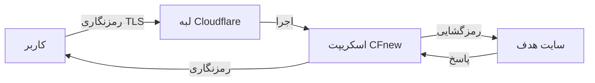
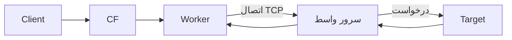
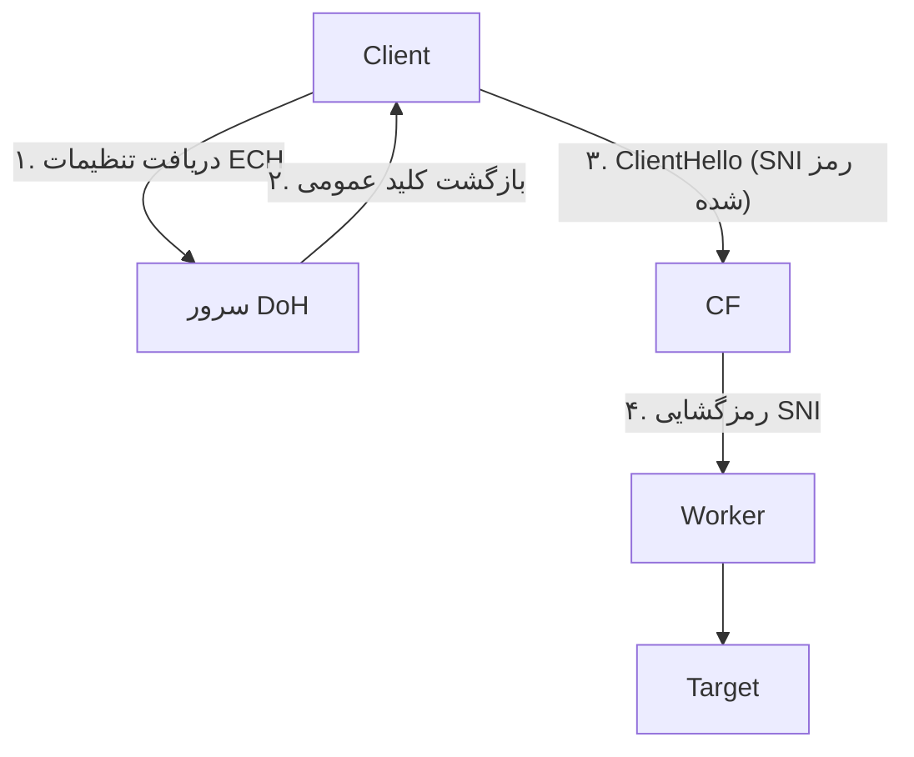

# CFnew - ترمینال v2.9.3

**زبان:** [中文](README.md) | [فارسی](فارسی.md)

[گروه تلگرام](https://t.me/+ft-zI76oovgwNmRh)

## 📖 فهرست مطالب

1.  [معرفی و فلسفه طراحی (Introduction & Philosophy)](#معرفی-و-فلسفه-طراحی-introduction--philosophy)
2.  [مفاهیم کلیدی: مثال پستچی (The Mailman Analogy)](#مفاهیم-کلیدی-مثال-پستچی-the-mailman-analogy)
3.  [معماری سیستم و جریان ترافیک (System Architecture)](#معماری-سیستم-و-جریان-ترافیک-system-architecture)
4.  [دانشنامه پیکربندی (Configuration Encyclopedia)](#دانشنامه-پیکربندی-configuration-encyclopedia)
    *   [۱. هویت و احراز هویت (Identity)](#۱-هویت-و-احراز-هویت-identity)
    *   [۲. شبکه و رله (Network & Relay)](#۲-شبکه-و-رله-network--relay)
    *   [۳. تنظیم پروتکل‌ها (Protocols)](#۳-تنظیم-پروتکل‌ها-protocols)
    *   [۴. کنترل منطقی (Logic Control)](#۴-کنترل-منطقی-logic-control)
    *   [۵. ترجیحات و پیشرفته (Preferred & Advanced)](#۵-ترجیحات-و-پیشرفته-preferred--advanced)
5.  [تحلیل عمیق و مقایسه پروتکل‌ها (Protocol Deep Dive)](#تحلیل-عمیق-و-مقایسه-پروتکل‌ها-protocol-deep-dive)
6.  [سناریوهای استفاده و بهترین روش‌ها](#سناریوهای-استفاده-و-بهترین-روش‌ها-scenarios)
7.  [راهنمای نصب از صفر (Zero to Hero)](#راهنمای-نصب-از-صفر-zero-to-hero)
8.  [راهنمای تنظیمات کلاینت (Client Configuration)](#راهنمای-تنظیمات-کلاینت-client-configuration)
9.  [عیب‌یابی و لاگ‌ها (Troubleshooting & Logs)](#عیب‌یابی-و-لاگ‌ها-troubleshooting--logs)
10. [راهنمای مدیریت API](#راهنمای-مدیریت-api)
11. [تاریخچه ستاره](#تاریخچه-ستاره)

---

## معرفی و فلسفه طراحی (Introduction & Philosophy)

پروژه CFnew یک اسکریپت پروکسی همه فن حریف است که بر روی Cloudflare Workers اجرا می‌شود. این ابزار برای **مقاومت در برابر فیلترینگ**، **عملکرد بالا** و **مدیریت آسان** طراحی شده است.

*   **بدون سرور (Serverless)**: نیازی به خرید VPS نیست؛ از شبکه جهانی کلودفلر با بیش از ۳۰۰ دیتاسنتر استفاده کنید.
*   **مدیریت بدون کد (No-Code Management)**: پس از نصب، تمام تنظیمات (UUID، IP، پروتکل‌ها) از طریق پنل گرافیکی وب و ذخیره‌سازی KV مدیریت می‌شوند. دیگر نیازی به ویرایش فایل کد نیست.
*   **استتار چندگانه (Polymorphic Camouflage)**: همزمان یک سرور VLESS، یک سرور Trojan و یک وب‌سایت عادی (شبیه‌سازی شده) است.
*   **مسیریابی هوشمند (Intelligent Routing)**: با تطبیق جغرافیایی خودکار، همیشه به نزدیک‌ترین و سریع‌ترین دیتاسنتر متصل می‌شوید.

---

## مفاهیم کلیدی: مثال پستچی (The Mailman Analogy)

برای درک کامل نحوه کار پروکسی و عبور از فیلترینگ، بیایید آن را به یک **سیستم پستی** تشبیه کنیم.

### نقش‌ها
*   **شما (Client)**: فرستنده نامه (کاربری که می‌خواهد سایت فیلتر شده را باز کند).
*   **سایت مقصد (Google/YouTube)**: گیرنده نامه.
*   **فیلترچی (Firewall)**: بازرس سخت‌گیر اداره پست که "لیست سیاه" دارد و نامه‌های گوگل را پاره می‌کند.
*   **ورکر (Cloudflare Worker)**: کارمند یک شرکت پستی معتبر در منطقه آزاد تجاری.
*   **شناسه (UUID)**: مُهر مخصوص یا گذرنامه شما (برای جلوگیری از سوءاستفاده غریبه‌ها).
*   **آی‌پی واسط (ProxyIP)**: همسایه دیوار به دیوار سایت مقصد (پیک موتوری مخفی).

### مراحل انجام کار

#### ۱. بسته‌بندی (The Envelope)
شما می‌خواهید به گوگل نامه بنویسید، اما نمی‌توانید روی پاکت بنویسید "گیرنده: گوگل".
*   **اقدام**: شما نامه اصلی (داده‌های رمزگذاری شده) را داخل یک پاکت اداری معمولی می‌گذارید که روی آن نوشته شده **"گیرنده: شرکت Cloudflare"**.
*   **احراز هویت**: روی در پاکت، **مُهر UUID** خود را می‌زنید. فقط Worker که لیست مُهرها را دارد می‌فهمد این نامه معتبر است.
*   **پروتکل**: این دقیقاً کاری است که پروتکل‌های **VLESS/Trojan** انجام می‌دهند؛ مخفی‌سازی و بسته‌بندی.

#### ۲. تحویل به پست (Transmission)
*   **اقدام**: نامه را به صندوق پست می‌اندازید.
*   **بازرسی**: فیلترچی نامه را می‌بیند. چون گیرنده "Cloudflare" (یک شرکت معتبر اینترنتی) است و ظاهر نامه کاملاً رسمی و امن (HTTPS/TLS) است، به آن شک نمی‌کند و اجازه عبور می‌دهد.
*   **نتیجه**: نامه شما از سد فیلترینگ عبور می‌کند و به انبار جهانی Cloudflare می‌رسد.

#### ۳. تفکیک (Sorting - The Worker)
*   **دریافت**: سیستم Worker نامه را تحویل می‌گیرد.
*   **بررسی**: ابتدا **مُهر UUID** را چک می‌کند.
    *   *مُهر اشتباه است؟* -> نامه دور ریخته می‌شود (قطع اتصال).
    *   *مُهر درست است؟* -> پاکت بیرونی را باز می‌کند.
*   **خواندن**: سپس Worker نامه اصلی را می‌بیند و متوجه می‌شود گیرنده واقعی **"Google"** است.

#### ۴. توزیع (Delivery Methods)
حالا Worker دو روش برای رساندن نامه دارد (بسته به تنظیمات شما):

*   **🅰️ تحویل مستقیم (Native Mode)**
    *   خود Worker شخصاً از انبار خارج می‌شود، به دفتر گوگل می‌رود و نامه را تحویل می‌دهد.
    *   *ویژگی*: سرعت بالا، اما گوگل چهره Worker (آی‌پی کلودفلر) را می‌بیند. برخی سایت‌ها (مثل نتفلیکس) ممکن است Worker را راه ندهند.

*   **🅱️ پیک مخفی (ProxyIP Mode)**
    *   ابتدا Worker فکر می‌کند رفتن مستقیم خطرناک است.
    *   سپس Worker نامه را به یک **پیک موتوری مخفی (ProxyIP)** می‌دهد.
    *   پیک نامه را به گوگل می‌رساند.
    *   *ویژگی*: گوگل فقط چهره پیک (آی‌پی مسکونی/محلی) را می‌بیند. عالی برای رفع تحریم‌ها.

#### ۵. بازگشت نامه (The Return Journey)
*   گوگل جواب نامه را می‌نویسد و به پیک یا Worker می‌دهد.
*   در نهایت Worker جواب را در یک پاکت با مُهر **"فرستنده: Cloudflare"** می‌گذارد.
*   نامه به دست شما می‌رسد. فیلترچی فقط می‌بیند که شما یک نامه اداری از Cloudflare دریافت کرده‌اید و از محتوای آن بی‌خبر است.

### ۶. توسعه مثال: مفاهیم دیگر (Further Concepts)

بیایید این سیستم پستی را با جزئیات کامل‌تر و عمیق‌تری بررسی کنیم تا درک بهتری از مکانیزم‌های پیچیده اینترنت آزاد داشته باشید:

#### انواع روش‌های حمل‌ونقل (Protocols)
این‌ها روش‌های مختلفی هستند که نامه‌ی شما (داده‌ها) از خانه به مقصد می‌رسد.

*   **روش استاندارد (TCP)**: مثل کامیون‌های پست دولتی است. کند، مطمئن، و برای هر بسته رسید می‌گیرد. اگر بسته‌ای گم شود، دوباره می‌فرستد.
    *   **HTTP/TLS**: نامه‌های معمولی که در پاکت‌های اداری امن ارسال می‌شوند.
*   **روش سریع (UDP)**: مثل پیک موتوری یا پهپاد است. سریع می‌رود و منتظر رسید نمی‌ماند.
    *   **Hysteria 2 / TUIC**: این‌ها مثل **پهپادهای مسابقه‌ای** هستند. آن‌ها از ترافیک جاده‌ها (TCP) رد نمی‌شوند، بلکه از آسمان (UDP) پرواز می‌کنند. برای همین برای بازی آنلاین عالی هستند. سیستم "کنترل ازدحام" آنها مثل یک خلبان ماهر است که وقتی هوا بد است، سرعت را کم می‌کند تا سقوط نکند.
    *   **WireGuard**: مثل یک **لوله کشی اختصاصی و نامرئی** است. یک کابل مستقیم از کامپیوتر شما به سرور مقصد کشیده شده که هیچکس آن را نمی‌بیند. بسیار سریع و امن است، اما چون لوله‌اش ثابت است، فیلترچی‌ها راحت‌تر می‌توانند آن را پیدا و مسدود کنند.
*   **روش‌های قدیمی (Legacy)**:
    *   **VMess / Shadowsocks**: شبیه به این است که نامه را به جای اداره پست، به **پسرخاله‌تان** (یک سرور شخصی) بدهید تا او نامه را پست کند. او نامه‌ها را با روش رمزی که فقط شما و او می‌دانید می‌نویسد.
*   **تونل‌زنی (Tunneling)**:
    *   **WARP**: یک **تونل زیرزمینی اختصاصی** است که شرکت Cloudflare مستقیماً از خانه شما به اینترنت آزاد حفر کرده است. شما وارد تونل می‌شوید و در آن سوی مرز بیرون می‌آیید.

#### دفترچه تلفن و آدرس‌دهی (DNS)
قبل از اینکه نامه بفرستید، باید آدرس خانه گیرنده را پیدا کنید.

*   **DNS (Domain Name System)**: مثل دفترچه تلفن شهر است. شما می‌پرسید "یوتیوب کجاست؟" و دفترچه به شما می‌گوید "خیابان آزادی، پلاک ۱۰".
*   **DNS Poisoning (مسمومیت)**: فیلترچی‌های بدجنس دفترچه تلفن‌های شهر را دستکاری کرده‌اند. وقتی آدرس "YouTube" را می‌گردید، آدرس "کلانتری محل" یا "سایت پیوندها" را به شما می‌دهند!
*   **DoH (DNS over HTTPS)**: برای جلوگیری از فریب خوردن، شما درخواست آدرس را در یک **پاکت دربسته و ضدگلوله** می‌گذارید و با پست پیشتاز به یک باجه امن در خارج از کشور می‌فرستید. هیچکس نمی‌تواند درخواست شما را ببیند یا آدرس غلط به شما بدهد.
*   **DNSTt (Tunneling)**: این یک ترفند فوق‌العاده است. شما اصلا نامه نمی‌فرستید! شما نامه اصلی‌تان را تکه تکه می‌کنید و در قالب "سوال‌های بی‌ربط از دفترچه تلفن" مخفی می‌کنید. فیلترچی فکر می‌کند شما فقط دارید دنبال شماره تلفن می‌گردید، در حالی که دارید اطلاعات رد و بدل می‌کنید.

#### ترفندهای استتار و فرار (Evasion Techniques)
چگونه بازرسان را گول بزنیم؟

*   **Mux (Multiplexing)**: به جای اینکه برای هر برگ کاغذ یک پاکت و تمبر جداگانه مصرف کنید (که هم گران است و هم کند)، **چندین نامه را در یک جعبه بزرگ** می‌گذارید و یکجا می‌فرستید. این کار باعث می‌شود تعداد رفت و آمدها به اداره پست کم شود و سرعت بالا برود.
*   **Padding (پدینگ - پنبه‌گذاری)**: فیلترچی‌ها به اندازه پاکت‌ها حساس هستند. اگر نامه خیلی کوچک باشد (مثلا فقط گفتید "سلام")، مشکوک می‌شوند. شما داخل پاکت **کاغذ باطله یا پنبه** می‌گذارید تا همه پاکت‌ها هم‌وزن و هم‌اندازه شوند. حالا فیلترچی نمی‌تواند از روی وزن و اندازه پاکت حدس بزند داخلش چیست.
*   **Fragmentation (تکه‌تکه کردن)**: نامه را با قیچی به **تکه‌های کوچک** می‌برید و هر تکه را در یک زمان متفاوت می‌فرستید. فیلترچی با دیدن یک تکه کاغذ پاره که رویش نوشته "یو..." چیزی نمی‌فهمد و اجازه عبور می‌دهد. گیرنده در مقصد تکه‌ها را ("...تیوب") کنار هم می‌گذارد و می‌خواند.
*   **SNI (Server Name Indication)**: این همان چیزی است که روی پاکت می‌نویسید "گیرنده: گوگل".
*   **ESNI / ECH (Encrypted SNI)**: این تکنولوژی جدید، نام گیرنده را هم **داخل پاکت** می‌گذارد. روی پاکت فقط نوشته "به: شرکت Cloudflare". فیلترچی می‌داند مقصد کلودفلر است، اما نمی‌داند نهایتاً نامه به دست گوگل می‌رسد یا مایکروسافت.

---

## معماری سیستم و جریان ترافیک (System Architecture)

### ۱. حالت بومی (Native Mode)
*مناسب برای: VLESS, Trojan, VLESS gRPC, xhttp*
در این حالت Worker مستقیماً ترافیک را پردازش می‌کند. کمترین تاخیر.



### ۲. حالت ProxyIP (رله)
*مناسب برای: VLESS, Trojan (با متغیر p)*
در این حالت Worker ترافیک را از طریق TCP به یک سرور واسط رله می‌کند.



### ۳. جریان هندشیک ECH (ECH Flow)
*مناسب برای: زمانی که ECH روشن است*
نام دامنه (SNI) رمزگذاری می‌شود تا فیلترچی مقصد را نبیند.



---

## دانشنامه پیکربندی (Configuration Encyclopedia)

در اینجا تمام متغیرهای موجود در کد را بررسی می‌کنیم.
**اولویت**: تنظیمات KV (پنل گرافیکی) > متغیرهای محیطی (Settings).

### ۱. هویت و احراز هویت (Identity)

<div dir="rtl">

| نام متغیر | نوع | پیش‌فرض | توضیحات | چرا استفاده کنیم؟ |
| :--- | :--- | :--- | :--- | :--- |
| **`u`** | String | (الزامی) | **UUID**. شناسه یکتا کاربر. رمز عبور اتصال شما. باید فرمت استاندارد UUID باشد. | **امنیت**. جلوگیری از سرقت ترافیک توسط دیگران. |
| **`tp`** | String | `u` | **رمز Trojan**. رمز اختصاصی برای پروتکل تروجان. اگر خالی باشد از UUID استفاده می‌شود. کلاینت آن را هش (SHA224) می‌کند. | **سازگاری**. برخی کلاینت‌های قدیمی Trojan با فرمت UUID مشکل دارند. |

</div>

### ۲. شبکه و رله (Network & Relay)

<div dir="rtl">

| نام متغیر | نوع | پیش‌فرض | توضیحات | چرا استفاده کنیم؟ |
| :--- | :--- | :--- | :--- | :--- |
| **`p`** | String | (خالی) | **ProxyIP**. مقصد فوروارد ترافیک (IP:Port). برای رفع تحریم یا مخفی‌سازی. | **رفع تحریم/مخفی‌سازی**. باز کردن سایت‌هایی که IP کلودفلر را بسته‌اند (مثل نتفلیکس). |
| **`s`** | String | (خالی) | **SOCKS5**. فرمت `user:pass@host:port`. اولویت بالاتر از `p` دارد. | **خروجی خاص**. استفاده از IP یک کشور خاص برای کارهای حساس. |
| **`d`** | String | (خالی) | **مسیر مخفی**. با تنظیم این، پنل فقط از `domain.com/path` باز می‌شود. | **ضد اسکن**. مخفی کردن پنل از دید ربات‌های اسکنر اینترنت. |
| **`wk`** | String | (خودکار) | **منطقه Worker**. اجبار Worker به اجرا در منطقه خاص (مثل SG, US). | **کاهش پینگ**. اتصال اجباری به نزدیک‌ترین سرور کلودفلر به ایران. |

</div>

### ۳. تنظیم پروتکل‌ها (Protocols)

برای فعال‌سازی `yes` و برای غیرفعال‌سازی `no` قرار دهید.

<div dir="rtl">

| نام متغیر | پروتکل | نوع | توضیحات | سناریوی استفاده |
| :--- | :--- | :--- | :--- | :--- |
| **`ev`** | VLESS | Native | سبک‌ترین، بدون وضعیت (Stateless)، بهترین عملکرد. | وب‌گردی روزانه، تماشای ویدیو (4K). |
| **`et`** | Trojan | Native | شبیه‌سازی ترافیک HTTPS، مقاوم در برابر اختلال. | محیط‌های با فیلترینگ شدید و حساس. |
| **`ex`** | xhttp | Native | پروتکل مخفی‌سازی مبتنی بر HTTP POST. | نیاز به استتار بالا (از طریق gRPC). |
| **`eg`** | VLESS gRPC | Native | انتقال از طریق gRPC. | شبکه‌هایی که با پایداری gRPC سازگارترند. |
| **`evm`** | VMess | Relay | فقط تولید لینک. نیاز به سرور بک‌اند دارد. | داشتن VPS شخصی و استفاده از CF به عنوان تانل. |
| **`ess`** | Shadowsocks| Relay | فقط تولید لینک. نیاز به سرور بک‌اند دارد. | دستگاه‌های قدیمی یا روترهایی که فقط SS دارند. |
| **`etu`** | TUIC | Direct | فقط تولید لینک. پروتکل UDP. | بازی آنلاین، کاهش پینگ (نیاز به سرور بک‌اند). |
| **`ehy`** | Hysteria 2 | Direct | فقط تولید لینک. پروتکل UDP. | سرعت بالا در شبکه‌های با اختلال شدید (نیاز به سرور بک‌اند). |
| **`ech`** | ECH | - | فعال‌سازی Encrypted Client Hello. | جلوگیری از فیلترینگ SNI، بالاترین سطح امنیت. |

</div>

### ۴. کنترل منطقی (Logic Control)

<div dir="rtl">

| نام متغیر | عملکرد | پیش‌فرض | توضیحات دقیق |
| :--- | :--- | :--- | :--- |
| **`rm`** | Region Match | `yes` | **تطبیق منطقه**. آیا Worker به طور هوشمند به نزدیک‌ترین نود متصل شود؟ اگر `no` باشد، تصادفی است. |
| **`qj`** | Downgrade | `yes` | **کنترل افت**. اگر `no` باشد، فال‌بک خودکار فعال می‌شود (اول مستقیم، اگر نشد SOCKS5، اگر نشد ProxyIP). |
| **`dkby`** | Port Filter | `no` | **فیلتر پورت**. اگر `yes` باشد، فقط نودهای TLS (443) ساخته می‌شوند و پورت‌های 80 حذف می‌شوند. با ECH اجباری می‌شود. |
| **`yxby`** | Prefer Filter | `no` | **فیلتر ترجیحی**. اگر `yes` باشد، تمام IPهای تمیز **غیرفعال** می‌شوند و فقط خود Worker می‌ماند. |
| **`ae`** | API Enable | `no` | **مدیریت API**. اگر `yes` باشد، دسترسی REST API باز می‌شود. فقط در صورت نیاز روشن کنید. |
| **`scu`** | SubConverter | (داخلی) | **مبدل اشتراک**. آدرس سرویس تبدیل لینک VLESS به Clash/Surge. پیش‌فرض `url.v1.mk` است. |
| **`homepage`** | Camouflage | (خالی) | **استتار**. آدرس سایتی که در ریشه دامنه `/` نمایش داده می‌شود. Worker محتوای این سایت را دانلود و نمایش می‌دهد. |

</div>

### ۵. ترجیحات و پیشرفته (Preferred & Advanced)

<div dir="rtl">

| نام متغیر | توضیحات | پیش‌فرض | منطق فیلتر |
| :--- | :--- | :--- | :--- |
| **`yx`** | **لیست دستی IPهای تمیز**. KV. فرمت: `IP:Port#Name`. | - | بالاترین اولویت، بدون فیلتر اپراتور. |
| **`yxURL`** | **منبع راه دور IP**. جایگزین منبع پیش‌فرض می‌شود. لینک فایل TXT. | (داخلی) | دانلود لیست از اینترنت. |
| **`ipv4`** | دریافت IPهای IPv4 تمیز. | `yes` | اگر `no` باشد، IPv4ها حذف می‌شوند. |
| **`ipv6`** | دریافت IPهای IPv6 تمیز. | `yes` | اگر `no` باشد، IPv6ها حذف می‌شوند. |
| **`ispMobile`** | شامل کردن IPهای مناسب **همراه اول**. | `yes` | فیلتر بر اساس نام در لیست wetest. |
| **`ispTelecom`**| شامل کردن IPهای مناسب **مخابرات**. | `yes` | فیلتر بر اساس نام در لیست wetest. |
| **`ispUnicom`** | شامل کردن IPهای مناسب **ایرانسل/رایتل**. | `yes` | فیلتر بر اساس نام در لیست wetest. |
| **`customDNS`** | آدرس DoH برای استعلام ECH (فقط HTTPS). | (داخلی) | برای دریافت کانفیگ ECH. پورت ۵۳ پشتیبانی نمی‌شود. |
| **`customECHDomain`**| دامنه هدف برای دریافت کانفیگ ECH. | (داخلی) | دریافت کلید عمومی از این دامنه. |

</div>

---

## تحلیل عمیق و مقایسه پروتکل‌ها (Protocol Deep Dive)

<div dir="rtl">

| ویژگی | VLESS (Native) | Trojan (Native) | VMess (Relay) | TUIC/Hysteria (Direct) |
| :--- | :--- | :--- | :--- | :--- |
| **نوع** | سبک و بدون وضعیت | شبیه‌ساز HTTPS | پروتکل کلاسیک | پروتکل سریع UDP |
| **نقش Worker** | سرور پروکسی | سرور پروکسی | رله WebSocket | فقط سازنده لینک (عبور نمی‌کند) |
| **نیاز به بک‌اند** | خیر (Serverless) | خیر (Serverless) | بله (VPS) | بله (VPS) |
| **مقاومت** | ⭐⭐⭐⭐ | ⭐⭐⭐⭐⭐ | ⭐⭐⭐ | ⭐⭐⭐⭐⭐ (کنترل ازدحام) |
| **تاخیر (Ping)** | 🟢 بسیار کم | 🟢 کم | 🟡 متوسط (یک پرش اضافه) | 🟢 بسیار کم (UDP) |
| **مصرف منابع** | 🟢 بسیار کم | 🟡 کم | 🔴 بالا | 🟡 متوسط |
| **کاربرد** | ویدیو 4K، وب‌گردی | شرایط امنیتی حساس | سازگاری با دستگاه قدیمی | بازی آنلاین، اینترنت ناپایدار |

</div>

### تکنولوژی ECH چیست؟
**Encrypted Client Hello (ECH)** تکنولوژی جدیدی است برای رمزگذاری مرحله دست دادن TLS (Client Hello)، به ویژه رمزگذاری **SNI (Server Name Indication)**.
1.  **مشکل**: در TLS سنتی، نام دامنه (SNI) به صورت متن باز ارسال می‌شود. فیلترچی می‌بیند شما به `google.com` وصل شده‌اید و آن را قطع می‌کند.
2.  **راه حل**: ECH نام دامنه را رمزگذاری می‌کند. فیلترچی فقط می‌بیند شما به Cloudflare وصل شده‌اید، اما نمی‌داند کدام سایت.
3.  **پیاده‌سازی**: اسکریپت Worker نقش "توزیع کننده" کلیدهای ECH را بازی می‌کند و آنها را از طریق DoH دریافت و در لینک اشتراک قرار می‌دهد.

---

## سناریوهای استفاده و بهترین روش‌ها (Scenarios)

### سناریو ۱: بهینه‌سازی مخصوص اپراتور (ISP Optimization)
**هدف**: شما کاربر اینترنت همراه اول هستید و می‌خواهید کمترین قطعی را داشته باشید.
1.  وارد پنل تنظیمات شوید.
2.  گزینه `ispMobile` را روی `yes` بگذارید.
3.  گزینه‌های `ispTelecom` و `ispUnicom` را روی `no` بگذارید.
4.  گزینه `epi` (IP پویا) را روشن کنید.
5.  **نتیجه**: لینک اشتراک شما فقط شامل IPهایی خواهد بود که روی شبکه همراه اول تست شده و سالم هستند.

### سناریو ۲: حالت بازی (Gaming Mode)
**هدف**: بازی آنلاین خارجی، نیاز به پینگ پایین و UDP.
1.  شما نیاز به یک سرور شخصی (VPS) دارید که Hysteria 2 روی آن نصب باشد.
2.  در تنظیمات Worker، گزینه `ehy = yes` را روشن کنید.
3.  سپس Worker لینکی می‌سازد که مستقیماً به VPS شما وصل می‌شود.
4.  کلاینت از این لینک استفاده می‌کند. چون Hysteria 2 بر پایه UDP است، پینگ بازی بسیار بهتر از TCP خواهد بود.

### سناریو ۳: امنیت و استتار حداکثری (Paranoid Mode)
**هدف**: جلوگیری از شناسایی توسط ربات‌ها و فیلترینگ SNI.
1.  تنظیم `d = /my-super-secret-path`.
2.  تنظیم `ech = yes`. رمزگذاری SNI.
3.  تنظیم `homepage = https://www.microsoft.com`. بازدید از ریشه دامنه، سایت مایکروسافت را نشان می‌دهد.
4.  **نتیجه**: حتی اگر فیلترچی دامین شما را بازرسی کند، فقط سایت مایکروسافت را می‌بیند. تحلیل ترافیک هم مقصد واقعی را نشان نمی‌دهد.

---

## راهنمای نصب از صفر (Zero to Hero)

### ۱. استقرار Worker
1.  وارد [داشبورد Cloudflare](https://dash.cloudflare.com) شوید.
2.  مسیر **Workers & Pages** -> **Create Worker**.
3.  نام را انتخاب کنید (مثلاً `cf-proxy`) و **Deploy** را بزنید.
4.  روی **Edit Code** کلیک کنید.
5.  **مهم**: فایل `少年你相信光吗` را از این پروژه باز کنید و تمام کد را کپی کنید.
6.  کد موجود در ادیتور Cloudflare را پاک کنید و کد کپی شده را جایگزین کنید.
7.  **Save and deploy**.

### ۲. پیکربندی KV (الزامی!)
بدون KV، پنل گرافیکی کار نمی‌کند.
1.  مسیر **Workers & Pages** -> **KV** -> **Create Namespace** -> نام `CONFIG` -> **Add**.
2.  بازگشت به Worker -> **Settings** -> **Variables** -> **KV Namespace Bindings**.
3.  **Add binding**:
    *   Variable name: `C` (حتماً با حرف بزرگ).
    *   Namespace: همان `CONFIG` که ساختید.
4.  **Save and deploy**.

### ۳. راه‌اندازی اولیه
1.  مسیر **Settings** -> **Variables** -> **Environment Variables**.
2.  **Add variable**:
    *   Variable name: `u`
    *   Value: `کد UUID شما` (با ابزار تولید UUID بسازید).
3.  **Save and deploy**.

### ۴. بررسی نهایی
به آدرس `https://your-domain/YOUR-UUID` بروید. اگر صفحه ترمینال با افکت ماتریکس را دیدید، همه چیز درست است!

---

## راهنمای تنظیمات کلاینت (Client Configuration)

### Sing-box
*   **Outbound**: پیشنهاد می‌شود از `vless` یا `trojan` استفاده کنید.
*   **ECH**: در بخش `tls`، خط `ech: { enabled: true }` را اضافه کنید.
*   **Multiplex**: برای سرعت بهتر، `multiplex: { enabled: true }` را فعال کنید.

### v2rayNG (اندروید)
*   **Sniffing**: حتماً روشن باشد (گزینه "استشمام ترافیک") تا سایت‌های داخلی و خارجی تفکیک شوند.
*   **Mux**: بهتر است خاموش باشد. در اینترنت ناپایدار باعث قطعی کل اتصال می‌شود.

### Surge (iOS/Mac)
*   **Skip-cert-verify**: اگر از IPهای تمیز (ProxyIP) استفاده می‌کنید، این گزینه باید `true` باشد.
*   **SNI**: مطمئن شوید که SNI برابر با دامنه Worker شماست.

---

## عیب‌یابی و لاگ‌ها (Troubleshooting & Logs)

### چگونه لاگ Worker را ببینیم؟
اگر اتصال برقرار نمی‌شود:
1.  در داشبورد Cloudflare، داخل Worker، به تب **Logs** بروید.
2.  روی **Begin log stream** کلیک کنید.
3.  با گوشی خود سعی کنید وصل شوید.
4.  لاگ‌ها را بررسی کنید:
    *   `Status 200`: اتصال موفق.
    *   `Status 403`: خطای UUID یا مسیر اشتباه.
    *   `Status 502`: مشکل در اتصال به ProxyIP.

### کدهای خطای رایج

<div dir="rtl">

| کد | پیام خطا | علت | راه حل |
| :--- | :--- | :--- | :--- |
| **1101** | Worker Threw Exception | خطای کد یا عدم اتصال KV | KV را چک کنید که به متغیر `C` متصل باشد. کد را دوباره کپی کنید. |
| **1033** | Argo Tunnel Error | خطای داخلی کلودفلر | معمولاً موقتی است. صبر کنید. |
| **1000** | DNS points to prohibited IP | خطای DNS / لوپ | ProxyIP احتمالاً به خود کلودفلر اشاره می‌کند (چرخه). ProxyIP را عوض کنید. |
| **1020** | Access Denied | مسدودی توسط فایروال | قوانین WAF کلودفلر ممکن است IP شما را بسته باشد. |
| **502** | Bad Gateway | عدم اتصال به بالا دست | **ProxyIP خراب است**. ورکر نمی‌تواند به `p` وصل شود. آن را عوض کنید. |
| **522** | Connection Timed Out | تایم‌اوت اتصال | سایت مقصد یا ProxyIP فیلتر شده یا پورت بسته است. |

</div>

---

## راهنمای مدیریت API

**آدرس پایه**: `https://your-domain/path/api/preferred-ips`
**امنیت**: فعلاً بر اساس UUID موجود در مسیر URL محافظت می‌شود.

### ۱. دریافت لیست (GET)
```bash
curl -X GET https://domain.com/uuid/api/preferred-ips
```

### ۲. افزودن IP جدید (POST)
اضافه کردن IP به لیست علاقه‌مندی‌ها. تکراری‌ها حذف می‌شوند.
```bash
curl -X POST https://domain.com/uuid/api/preferred-ips \
  -H "Content-Type: application/json" \
  -d '{"ip": "1.2.3.4", "port": 443, "name": "SG-Optimized"}'
```

### ۳. حذف IP (DELETE)
```bash
curl -X DELETE https://domain.com/uuid/api/preferred-ips \
  -H "Content-Type: application/json" \
  -d '{"ip": "1.2.3.4"}'
```

### ۴. پاکسازی کامل (DELETE)
حذف تمام IPهای دستی و بازگشت به حالت پیش‌فرض.
```bash
curl -X DELETE https://domain.com/uuid/api/preferred-ips \
  -H "Content-Type: application/json" \
  -d '{"all": true}'
```

---

## تاریخچه ستاره

[](https://www.star-history.com/#byJoey/cfnew&Timeline&LogScale)
